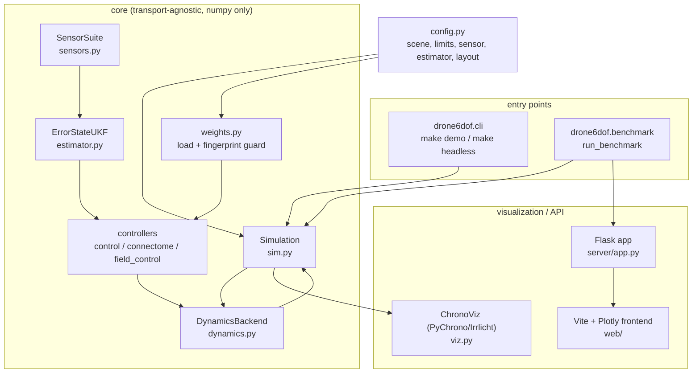
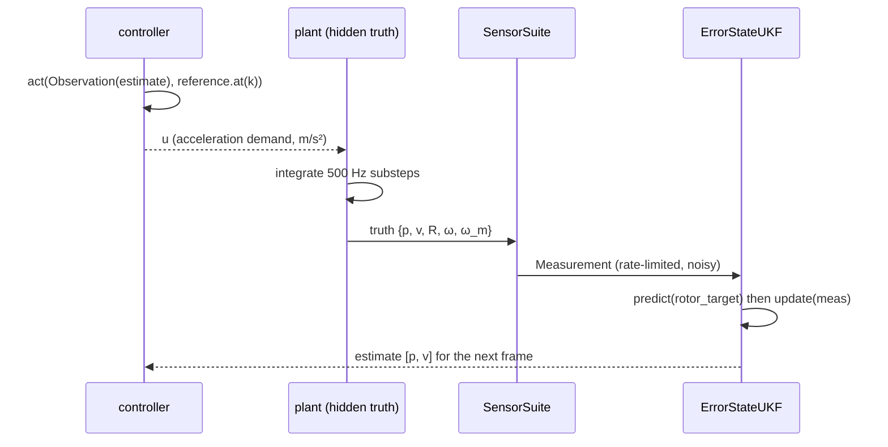

# Architecture

This page describes how the pieces fit together, how a single control frame
flows through the stack, and where each responsibility lives in the source tree.

## 1. Layers

The core is deliberately free of Chrono and Flask imports: `sim.py` imports no
renderer, so the headless CLI, the tests and the dashboard all drive the same
`Simulation` (`src/drone6dof/sim.py:1-5`).

## 2. Module map

| Module | Responsibility |
|---|---|
| `config.py` | The `quad6dof` example: steps, limits, initial state, scene, teacher kwargs, sensor/estimator config, obstacle layout, preset scenes |
| `params.py` | Physical constants and `QuadParams` (mass, inertia, rotor/motor/battery, autopilot gains) |
| `scene.py` / `geometry.py` | Scene (goal + obstacles) and 2.5-D obstacle geometry (boxes/cylinders, SDF, normals, ray casting) |
| `task.py` | Navigation task contract: obstacle features, telemetry, success mask |
| `reference.py` | Constant-goal reference `r(t)=goal`, `ṙ=r̈=0` |
| `plant.py` / `so3.py` / `dynamics.py` | The 6-DoF plant, SO(3) utilities and the backend interface (`NumpyPlantBackend`, plus a `ChronoDynamicsBackend` stub) |
| `sensor.py` | LiDAR scan + cues for the sensor-conditioned policy |
| `sensors.py` | Onboard sensor suite (GPS/IMU/INS/baro/mag/LiDAR) producing `Measurement` / `Observation` |
| `estimator.py` | Error-state unscented Kalman filter |
| `control.py` | `DSGuidanceController` (teacher) and `ClassicalPDController` |
| `policy.py` | Policy input assembly and `ReferenceAccelEstimator` |
| `connectome.py` | Sparse recurrent connectome ANN and its integrate-and-fire SNN transfer |
| `field.py` | Trajectory-anchored potential basis, teacher barrier, DS modulation |
| `field_control.py` | `FieldDSController` (`field_ann`, `field_snn`) |
| `train.py` / `train_field.py` | torch distillation (separate training image) |
| `weights.py` | Weight-bundle format, load/save and the config fingerprint guard |
| `sim.py` | Closed-loop `Simulation`, history, metrics, CSV/NPZ export |
| `benchmark.py` | Batch runs → JSON report (dashboard server and tests) |
| `viz.py` | PyChrono/Irrlicht visualization layer |
| `cli.py` | Command-line entry point and `make_controller` factory |

## 3. One control frame

`Simulation.step` is the whole loop (`src/drone6dof/sim.py:124-163`):

1. The controller is called with `Observation(state=self._est_state, gps_ok=...)`
   — never the hidden truth (`sim.py:126-129`).
2. The command `u` is clipped to `control_limit` and passed to the backend
   (`sim.py:130-141`; the plant clips again at `plant.py:116`).
3. After the plant step, the true pose/rotor state is read and a `Measurement`
   is produced for the **next** frame's update (`sim.py:142-157`).
4. Frame index `k` advances and the frame is recorded (`sim.py:161-163`,
   `sim.py:193-217`).

`reset()` seeds the plant, the controller, the estimator and the sensors
(`sim.py:93-121`). Timing: one `step()` is one outer frame of `dt = 0.02 s`
(50 Hz); the plant integrates `round(dt · inner_hz)` substeps internally
(500 Hz) — see [physics.md](physics.md).

## 4. Estimator-in-the-loop

The plant owns the hidden state; every controller consumes only the UKF estimate.
This is what makes the demo a *deployment-like* closed loop rather than a
truth-based one-shot comparison. The learned controllers are distilled with the
estimator in the loop too (teacher labels on the estimate), so training matches
deployment (`train.py:184-249`). See [estimation.md](estimation.md).

## 5. Configuration and the fingerprint guard

The behavioural configuration lives in `config.py` and is hashed into the weight
bundle's fingerprint (`weights.py:72-141`). A bundle trained for a different
plant, scene, teacher, sensor suite or estimator is **refused**
(`weights.py:270-276`, `weights.py:321-327`) rather than silently serving a stale
policy. The two bundle formats are:

| Format | File | Contents |
|---|---|---|
| `ann2snn.drone6dof.connectome@3` | `weights/quad6dof_connectome.npz` | `w_in`, `w_out`, sparse `edges`, `polarity`, `w_mag`, fields |
| `ann2snn.drone6dof.field@1` | `weights/quad6dof_field.npz` | same schema plus the `FieldConfig` block |

`weights/quad6dof_reference_io.npz` and `weights/quad6dof_field_ref.npz` hold
torch reference inputs/outputs for the no-torch parity tests.

## 6. Surfaces

### PyChrono view
`ChronoViz` builds a kinematic scene (ground grid, obstacles, goal sphere, drone
with four spinning rotors and a body triad, a trail) and sets the body pose from
the numpy plant each frame (`viz.py:189-368`). No Chrono dynamics are integrated.
`ChronoDynamicsBackend` is an explicit stub for a future Chrono-integrated rigid
body (`dynamics.py:133-147`). See [docs/index.md](index.md) for the demo media.

### Dashboard
`server/app.py` is a thin Flask layer over `benchmark.py`: `GET /api/health`,
`GET /api/controllers`, `POST /api/simulate`, `POST /api/benchmark`, plus the
built Vite assets. `run_benchmark` runs each requested controller on a fresh
plant on the same scene (`benchmark.py:182-341`) and returns per-controller
traces, telemetry, spike events, LiDAR scans, metrics and the SNN−ANN deltas.
The frontend (`web/`) renders a Plotly 3-D stage, a spike raster and charts. See
[control.md](control.md#6-dashboard-execution) for the API path.

## 7. Schematics

- [assets/schematics/architecture.svg](assets/schematics/architecture.svg) — this
  page's block diagram as replaceable artwork.
