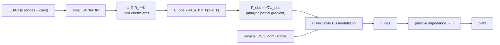

# Potential field, and the structured ANN → SNN

Source of truth: `src/drone6dof/field.py` (basis, teacher, modulation),
`src/drone6dof/field_control.py` (`FieldDSController`),
`src/drone6dof/train_field.py` (distillation), `src/drone6dof/connectome.py`
(the network).

This page explains the **structured** architecture: the network does **not learn
the control law**. It predicts a compact obstacle-field representation; the
gradient, the modulation and the low-level control are analytic and never
learned. This is what distinguishes `field_ann`/`field_snn` from the end-to-end
`ann`/`snn` (see the contrast in §7).

## 1. Pipeline

The net outputs only the ``K`` non-negative coefficients ``a``; everything
downstream is analytic (`field.py:1-14`, `field_control.py:1-8`).

## 2. Field configuration

`FieldConfig` (`field.py:47-76`):

| Field | Default | Meaning |
|---|---|---|
| `h` | 8 | nominal-DS preview points |
| `m` | 3 | centres per preview point (on-axis + both lateral) |
| `K = h·m` | 24 | basis size |
| `preview_dt` | 0.05 s | preview integration step |
| `lateral` | 0.4 m | lateral offset for the side centres |
| `sigma` | 0.5 m | RBF bandwidth |
| `r_influence` | 1.5 m | teacher barrier influence radius |
| `field_limit` | 2.0 | coefficient/field clip |
| `f_ref` | 1.0 | field magnitude giving full modulation weight |
| `lam_t` | 0.8 | tangential stretch at full weight |
| `gains` | see §3 | nominal-DS gains |

## 3. Nominal DS (analytic, kept)

The stable nominal velocity field (`field.py:79-89`) is a radial attractor with
curl in the horizontal plane and a vertical climb term:

$$
v_x = -g_r e_x - g_c e_y,\qquad
v_y = -g_r e_y + g_c e_x,\qquad
v_z = -g_\text{climb} e_z,
\qquad
v_\text{nom} = v\,\min\!\left(\frac{v_\text{cap}}{\lVert v\rVert},1\right),
$$

with $e = p - r$, $g_r = 0.6$, $g_c = 1.35$, $g_\text{climb} = 0.45$,
$v_\text{cap} = 1.4$ (`field.py:38-44`). This matches the example teacher
(`config.py:66`).

The basis centres are **anchored to a short preview of this nominal DS**
(`field.py:92-126`): starting at the current position, integrate $h$ points at
`preview_dt`, take unit headings $v/\lVert v\rVert$, and per point place three
centres — the point itself and offsets $\pm\lambda_\text{lat}\,\hat\perp$ with
$\hat\perp = (-h_y, h_x, 0)$ (`field.py:118-126`). The field is therefore
trajectory-relative, not world-global. Note the preview is short: $h=8$ points
at `preview_dt = 0.05 s` at ≤ `cap = 1.4 m/s` spans ≤0.56 m, well inside the
`r_influence = 1.5 m` teacher barrier, so the field is deliberately **local**.

## 4. Normalized Gaussian RBF basis

For a point $x$ and centres $c_k$ (horizontal components only),
`field.py:128-156`:

$$
\phi_k(x) = \exp\!\left(-\frac{\lVert x_{xy} - c_{k,xy}\rVert^2}{2\sigma^2}\right),\qquad
s = \sum_k \phi_k,\qquad
U_\text{obs}(x) = \sum_k a_k \frac{\phi_k(x)}{s(x)}.
$$

The obstacle vector field is the **analytic gradient** of the normalized basis
(quotient rule), never a separately learned quantity:

$$
\nabla U = \frac{\sum_k a_k \nabla\phi_k}{s} - \frac{\left(\sum_k a_k\phi_k\right)\left(\sum_k \nabla\phi_k\right)}{s^2},
\qquad
F_\text{obs} = -\nabla U,
$$

with $\partial\phi_k/\partial x = -\phi_k (x-c_k)/\sigma^2$. The vertical
component is zero — the field acts in the horizontal plane only
(`field.py:142-153`).

**This is a partial gradient with the centres frozen.** The centres $c_k$ are
recomputed from the current state every frame, so the potential is really
$U_\text{obs}(x;c(x))$; $\nabla_x U$ differentiates only the explicit $x$
argument and omits the centre-motion term. It is therefore *not* in general the
total derivative of a fixed global potential, and this documentation avoids
calling it a "globally conservative field".

## 5. Privileged teacher potential (training target only)

The DS teacher is privileged (it uses true geometry). Its barrier potential and
gradient (`field.py:159-192`) are

$$
U^*(x) = \sum_{\text{obs}} \tfrac12 \max\!\big(0,\ r_\text{infl} - d(x)\big)^2,
\qquad
\nabla U^* = -\sum_{\text{obs}} \big(r_\text{infl} - d\big)\,n_\text{out}\,\mathbf 1[d < r_\text{infl}],
$$

where $d$ is the obstacle signed distance and $n_\text{out}$ the outward normal.
`teacher_coeffs` samples $U^*$ at the trajectory-anchored centres and returns the
value vector used as the **supervised target** (`field.py:187-192`).

**Gradient-matched target (plan D).** The training target is no longer `U*`
values: `field.fit_field_coeffs` fits the non-negative coefficients whose
gradient best matches the teacher field `F* = −∇U*` at the evaluation point, so
what the controller consumes (`−∇U`) is what is supervised. Value-only MSE is
retired. (A Sobolev loss with additional velocity/control terms is still future
work; the current target is gradient matching only.)

## 6. Billard-style DS modulation

Given $v_\text{nom}$ and $F_\text{obs}$ (`field.py:195-210`):

$$
n = \frac{F_{\text{obs},xy}}{\lVert F_{\text{obs},xy}\rVert},\quad
t = (-n_y, n_x)\ \text{(flipped so } v_\text{nom}\cdot t \ge 0),\quad
w = \mathrm{clip}\!\left(\frac{\lVert F_{\text{obs}}\rVert}{f_\text{ref}},0,1\right),
$$

$$
v_\text{des} = v_\text{nom} - w\,(v_\text{nom}\cdot n)\,n + \lambda_t\,w\,(v_\text{nom}\cdot t)\,t.
$$

When $F_\text{obs}\to 0$ (no obstacle nearby) the modulation matrix tends to the
identity, so the goal attractor is preserved. `FieldDSController` then reuses the
same passive impedance as the teacher to produce the acceleration demand
(`field_control.py:132-139`).

Two honest caveats: (i) when $v_\text{nom}$ is parallel to $n$ the tangent $t$
flips discontinuously and both components can vanish — a potential stall; (ii)
for boxes (`core_offset = 0`) with `dead_radius > 0`, $\gamma < 1$ can occur
*outside* the surface, giving $\lambda_r < 0$ (a reversal). This is therefore a
**Billard-inspired** normal/tangential modulation, not a formal collision-free
guarantee. The shipped start/pillar/goal are collinear and the curl term breaks
the symmetry, so the modulation is exercised but not exhaustively tested here.

## 7. What the ANN field model is, and what the transferred SNN is

### The field ANN
`FIELD_NET` is deliberately small: `n_neurons = 128`, fan-in `k = 8`,
`seed = 42` (`train_field.py:53-54`). It is a sparse recurrent ReLU network with
three recurrent evaluations per frame:

$$
h \leftarrow \mathrm{ReLU}\!\big(W_\text{in}x + W_\text{rec}h\big)\ \times 3,
\qquad
a = \mathrm{ReLU}\!\big(W_\text{out}h\big) \in \mathbb R_+^K,
$$

`train_field.py:166-172`. It is distilled by MSE to `teacher_coeffs` on a dataset
that combines closed-loop teacher rollouts (through the plant and UKF) with random
coverage states, across randomised box/cylinder scenes
(`build_field_dataset`, `train_field.py:94-129`). The network sees only the LiDAR
features; it learns the **field coefficients**, not forces or accelerations.

### The transferred SNN
The transfer is `RateCodedConnectomeSNN` over the **same topology and weights**
(`connectome.py:138-190`): integrate-and-fire with `micro_steps = 10` per frame,
threshold `v_th = 1.0`, non-negative membrane, soft reset, and the command taken
as the mean output rate over the micro-steps. `last_spikes` records neurons that
fired at any micro-step within the frame. For `field_snn`, the spiking network
outputs the `K` field coefficients in the same way as `field_ann` (rate-coded,
not exact) — the SNN never outputs a control command
(`field_control.py:85-98,148-151`).

Measured transfer error (`tools/snn_transfer_eval.py`, 64-frame deployment
sequence; `gain` is the least-squares scale of SNN vs ANN):

| T (micro-steps) | RMSE | NRMSE | Pearson | cosine | gain | silent |
|---|---|---|---|---|---|---|
| 1 | 0.666 | 0.359 | 0.686 | 0.755 | 0.588 | 0.965 |
| 8 | 0.566 | 0.314 | 0.911 | 0.847 | 0.565 | 0.925 |
| 64 | 0.562 | 0.315 | 0.923 | 0.843 | 0.560 | 0.919 |
| 128 | 0.563 | 0.316 | 0.924 | 0.843 | 0.560 | 0.915 |

The *shape* correlates strongly (Pearson ≈0.92) but the SNN **under-scales** the
ANN by ≈0.56 and R² is negative (a scale-matched comparison fails); ~92 % of
neurons are silent over the sequence. The error flattens beyond T≈16, i.e. more
micro-steps do **not** recover the scale — the gap is the readout rate/threshold,
not the integration window. This is precisely why the transfer is called
rate-coded, not lossless.

### Contrast with the end-to-end connectome controllers

| | end-to-end `ann`/`snn` | structured `field_ann`/`field_snn` |
|---|---|---|
| Network output | acceleration demand (3) | field coefficients ($K=24$) |
| Network size | `N=1000`, `k=40` (~89 000 params) | `N=128`, `k=8` (~9 984 params) |
| Distillation target | teacher acceleration `u` | teacher potential $U^*$ at centres |
| What is learned | the control law | a compact obstacle-field |
| Gradient / modulation / impedance | learned implicitly | analytic, never learned |
| Training file | `train.py` | `train_field.py` |
| Bundle | `quad6dof_connectome.npz` | `quad6dof_field.npz` |

The end-to-end net carries the whole policy in its weights; the structured net
only parameterizes the field, which is why it needs ~9× fewer parameters. **This
comparison is confounded and must be read carefully**: the `field_*` arms keep
the exact analytic nominal DS, goal reference, modulation and impedance, so they
do not have to learn goal-reaching at all, whereas the end-to-end net learns the
whole control law from scratch. "9× fewer parameters and still works" therefore
shows that *analytic structure helps*, not that the RBF field is inherently more
parameter-efficient. The comparison is also single-scene and single-seed.

## 8. Measured result

Estimate-only `make compare` (500 steps, seed 0). `clr` = minimum clearance (m),
`fin` = final goal distance (m), `reach` = within the 0.30 m tolerance. The
`field_*` arms now use the global A* planner + gated LiDAR residual; `ann`/`snn`
and `ds_guidance` are the unchanged baselines.

| scene | controller | coll | clr | fin | reach |
|---|---|---|---|---|---|
| pillar | `ds_guidance` | 0 | 0.019 | 1.317 | no |
| pillar | `ann` | 0 | 0.133 | 0.772 | no |
| pillar | `snn` | 0 | 0.061 | 0.812 | no |
| pillar | `field_ann` | 0 | 0.338 | 0.073 | yes |
| pillar | `field_snn` | 0 | 0.114 | 0.098 | yes |
| boxes | `snn` | 17 | −0.167 | 1.191 | no |
| boxes | `field_ann` | 0 | 0.328 | 0.116 | yes |
| boxes | `field_snn` | 0 | 0.099 | 0.097 | yes |
| wall | `ann` | 22 | −0.148 | 0.402 | no |
| wall | `field_ann` | 0 | 0.250 | 0.471 | no |
| wall | `field_snn` | 0 | 0.182 | 0.163 | yes |
| slalom | `ds_guidance` | 4 | −0.093 | 4.880 | no |
| slalom | `ann` | 58 | −0.149 | 1.077 | no |
| slalom | `field_ann` | 0 | 0.338 | 0.162 | yes |
| slalom | `field_snn` | 0 | 0.285 | 0.059 | yes |

Corrected by plan D: `wall` went from 44/42 collisions to **0**, `slalom` from
28/11 to **0**, and the field arms now reach on 7 of 8 scene/arm combinations
(the exception is `field_ann` on `wall`, final 0.471 m). The end-to-end
`ann`/`snn` baselines are unchanged and still fail on `wall`/`slalom`.

Two honest caveats. First, the global A* planner consumes the **privileged scene
(a map)** — consistent with the privileged teacher, but it assumes a map at
deployment. Second, the field **SNN** transfer fidelity is low: after readout
calibration its magnitude matches the ANN (`gain ≈ 0.8`) but its per-dimension
correlation is only Pearson ≈ 0.45 (`tools/snn_transfer_eval.py --kind field`),
so the residual it supplies is coarse; the loop stays safe because the planner
owns the route. These are single-seed runs: "collision-free" means collision-free
in the evaluated scenario, not a proven guarantee
([limitations.md](limitations.md)). See
[`tools/compare_controllers.py`](../tools/compare_controllers.py) and
[`tools/field_viz.py`](../tools/field_viz.py).

## 9. Schematics

- [assets/schematics/field.svg](assets/schematics/field.svg) — RBF basis anchored
  to the preview, analytic gradient, and the modulation geometry.
