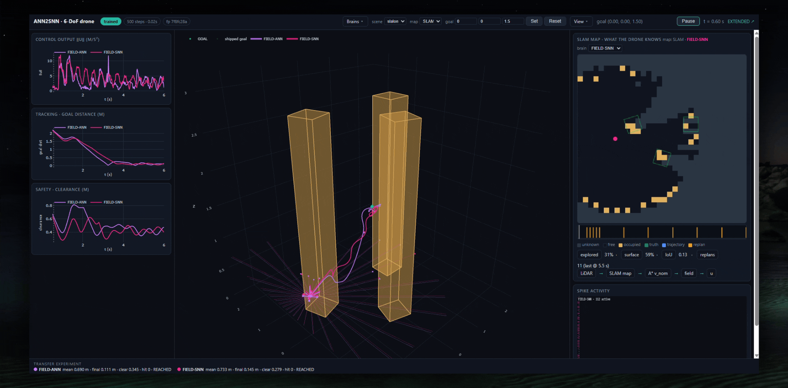
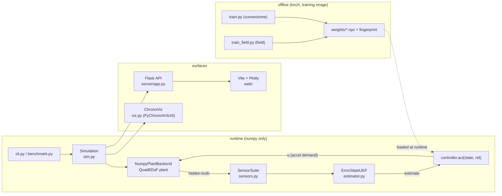

# ANN2SNN · 6-DoF drone — documentation

A Dockerized port of the 6-DoF quadcopter navigation example from the
[ANN2SNN](https://github.com/romanklis/ANN2SNN) project (`drone-example` branch):
a numpy plant with the analytic DS-guidance teacher, a PID baseline, the trained
**connectome ANN** and its **integrate-and-fire SNN transfer**, plus a
**structured field** architecture in which a small LiDAR-conditioned network
predicts obstacle-field coefficients instead of a control law. The 3-D view is
rendered with [Project Chrono](https://projectchrono.org) / PyChrono; a separate
Flask + Vite/Plotly dashboard compares the controllers on the same scenes.

*Above: the interactive PyChrono view and the browser dashboard (also available
as `assets/demo.mp4` with higher quality / smaller size).*

## Navigation

| Page | What it covers |
|---|---|
| [architecture.md](architecture.md) | System architecture, module map, per-frame data flow |
| [physics.md](physics.md) | Equations of motion, actuator/battery model, inner substepping |
| [estimation.md](estimation.md) | Sensor suite and the error-state UKF (estimate-only control) |
| [sensing.md](sensing.md) | Obstacle geometry and the LiDAR scan + cues |
| [field.md](field.md) | Potential-field methodology; structured ANN vs its SNN transfer |
| [control.md](control.md) | Where the controllers live and how they are executed |

Every equation and diagram cites the module and line it comes from, so the
documentation tracks the code. The authoritative behavioural configuration is the
weight-bundle fingerprint (`src/drone6dof/weights.py`), not this prose.

## Two surfaces

| Surface | Command | Nature |
|---|---|---|
| PyChrono view | `make demo` | Interactive 3-D visualization (drone, rotors, trail, pillar, HUD) |
| Dashboard | `make dashboard` | Flask API + Vite/Plotly page comparing controllers (data-only) |

Both surfaces are Docker-only. See the root [README](../README.md) for build,
test and training targets.

## High-level architecture

## Controllers

Six controllers are defined (`src/drone6dof/benchmark.py:38-45`); PID is a
CLI/compare baseline and is hidden from the dashboard.

| `--controller` | role | sensor | spiking | recurrent |
|---|---|---|---|---|
| `ds_guidance` | analytic DS teacher — the distillation label source | no | no | no |
| `pid` | classical PD + feed-forward baseline (collides with the pillar) | no | no | no |
| `ann` | 1000-neuron sparse recurrent connectome ANN, distilled from the teacher | yes | no | yes |
| `snn` | integrate-and-fire transfer of the connectome ANN | yes | yes | yes |
| `field_ann` | small ANN → trajectory-anchored obstacle-field coefficients + DS | yes | no | yes |
| `field_snn` | spiking transfer of the field ANN; never outputs control directly | yes | yes | yes |

See [control.md](control.md) for the dispatch and execution loop, and
[field.md](field.md) for the two distinct uses of the connectome network.

## Schematics

Hand-drawn schematics are tracked as placeholders in this commit; each file is a
labelled box describing what the final artwork should show
(`assets/schematics/README.md`). Replace the SVG contents without renaming the
files to keep the doc links valid.

- [architecture.svg](assets/schematics/architecture.svg) — system block diagram
- [plant-control-loop.svg](assets/schematics/plant-control-loop.svg) — plant + autopilot loop
- [ukf.svg](assets/schematics/ukf.svg) — UKF predict/update
- [lidar.svg](assets/schematics/lidar.svg) — scan, nearest return, cues
- [field.svg](assets/schematics/field.svg) — potential basis and DS modulation
- [control-execution.svg](assets/schematics/control-execution.svg) — controller dispatch and frame loop

## Attribution

Ported from the ANN2SNN project (`drone-example` branch, commit `bafe4cf`), MIT
licensed. Container base image `lucamarchiano/pychrono_simulator:1.0`. See
[`LICENSE`](../LICENSE) and [`NOTICE`](../NOTICE) for provenance.
